Welcome! This is a complete fullstack ApnaMarket an e-commerce web application built with:

# Frontend: React

# Backend: Node.js + Express

# Database: MongoDB

# Authentication: JWT-based login/signup

# UI/UX: CSS & responsive design

This app allows users to register, login, add items to cart, get details of product and place orders — just like a real online store.

# => Features

# User signup & login with secure JWT authentication

# Product listing and detail view

# Add to cart, update quantities

# Checkout with order placement

# Admin/user support (customize if needed)

Project Structure

APNAMARKET/
├── server/ # Node.js + Express + MongoDB API
├── client/ # React application
├── README.md # This file
├── .gitignore # to ignore node-modules, .env
Getting Started
— just follow these steps!

Before you begin, make sure you have the following installed:

# Node.js (v18 or higher recommended)

    Go to https://nodejs.org
    Download the LTS version (recommended for most users)
    Install it like any normal software
    After installation, verify: node -v

1. Clone the repository

git clone https://github.com/Kuldeep3330/ApnaMarket.git
cd APNAMARKET 2. Set up the backend

cd server
npm install
Create a .env file in backend/ with the following:

.env
PORT=3001
MONGO_URI=your-mongodb-connection-string
JWT_SECRET=your-secret-key
Then start the server:
npm run dev
TYhe backend is running on http://localhost:3001

3. Set up the frontend

cd ../client
npm install
npm run dev
The frontend will usually run on http://localhost:5173

API Overview

GET /api/v1/products //List all products
GET /api/v1/:id //get sigle product
POST /api/v1/cart //Add/update cart
GET /api/v1/cart //View cart
DELETE /api/v1/cart/:id //Remove cart item
DELETE /api/v1/cart/ //Clear entire cart
POST /api/v1/orders //Place order

Authentication
login/signup via /api/v1/auth

Token stored in localStorage

Token sent in headers using:
Authorization: Bearer <your-token>

Screenshots
Add some screenshots of your app UI here (e.g. homepage, cart, checkout page).
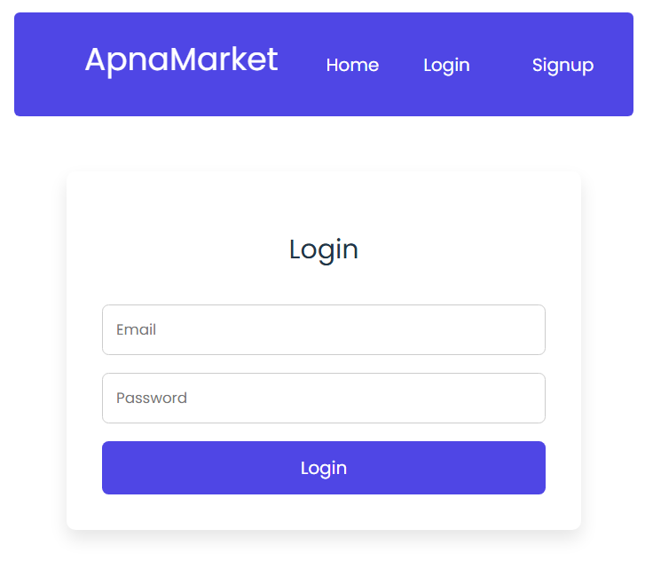 # login page

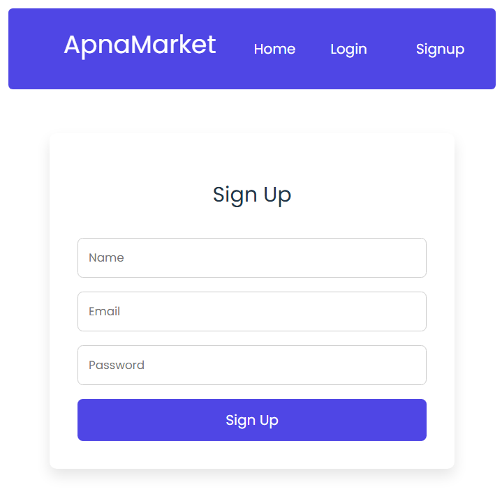 # signup page

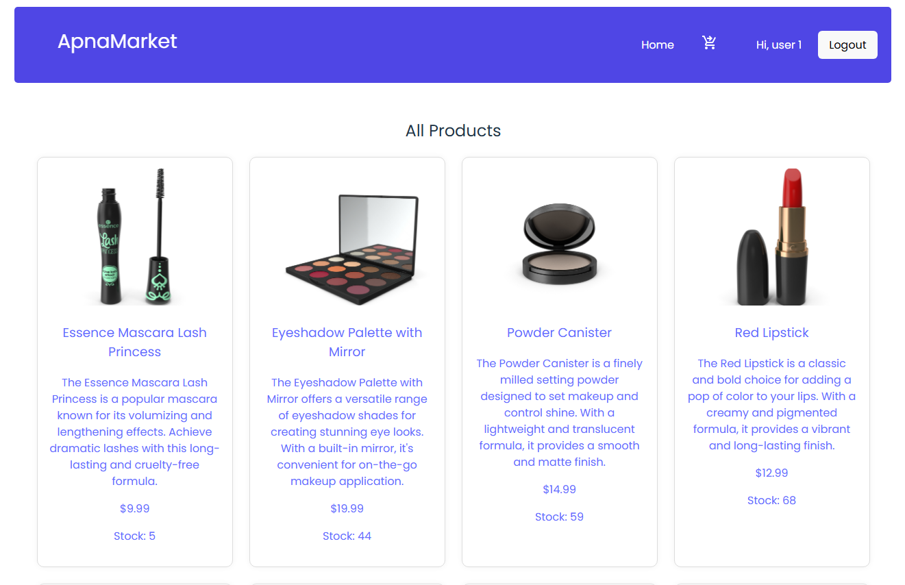 # get all products

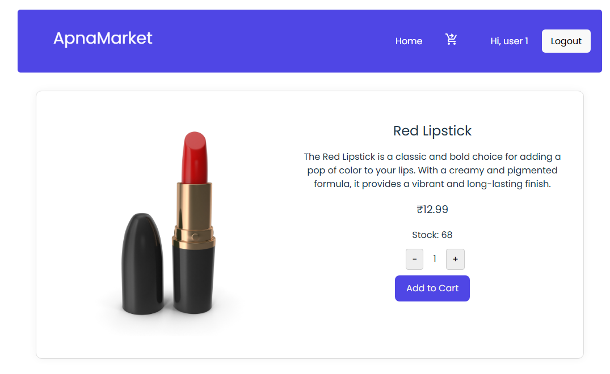 # get detail of product

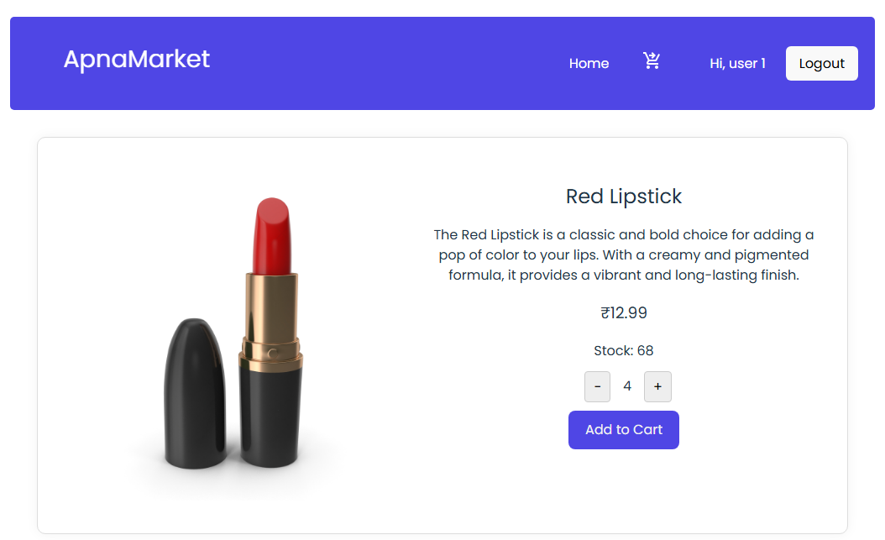 # quantity of item increased and decreased

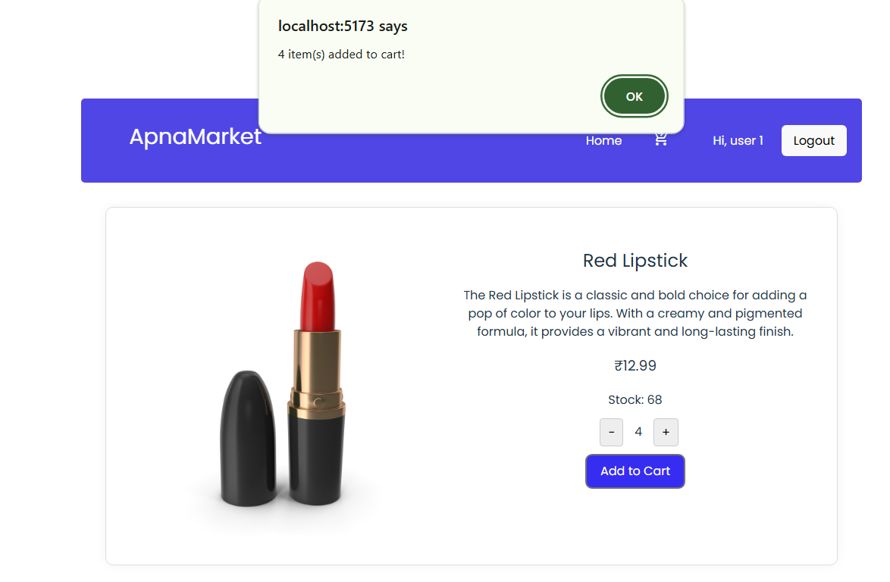 # item added to the cart

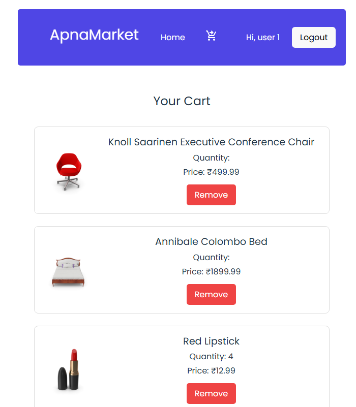 # get cart details

 # get navbar with logout

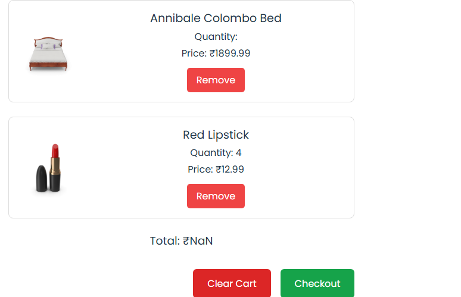 # get cart with clear cart and checkout

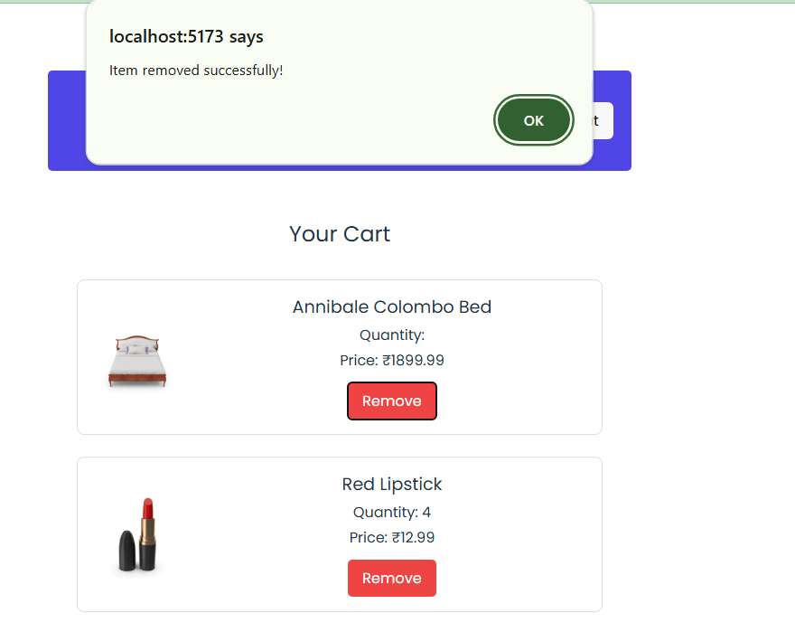 # item removed from cart

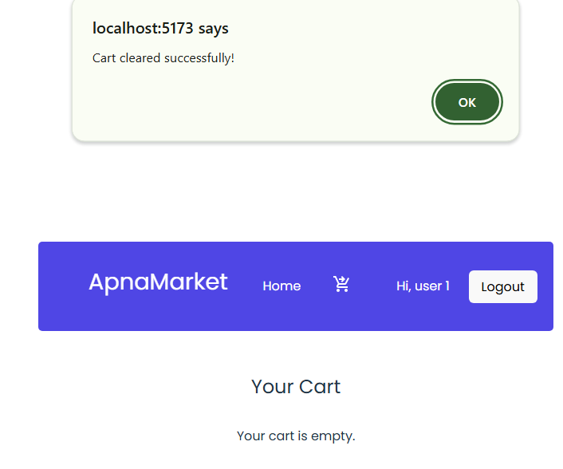 # cart cleared

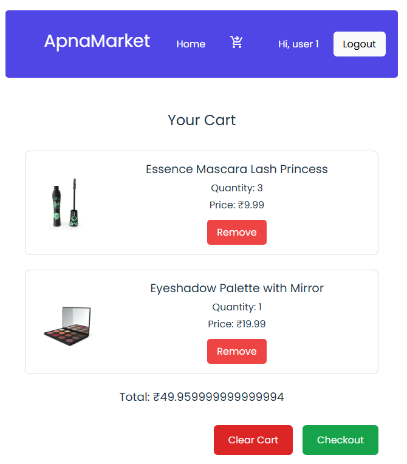 # remove item from cart

 # checkout successfully

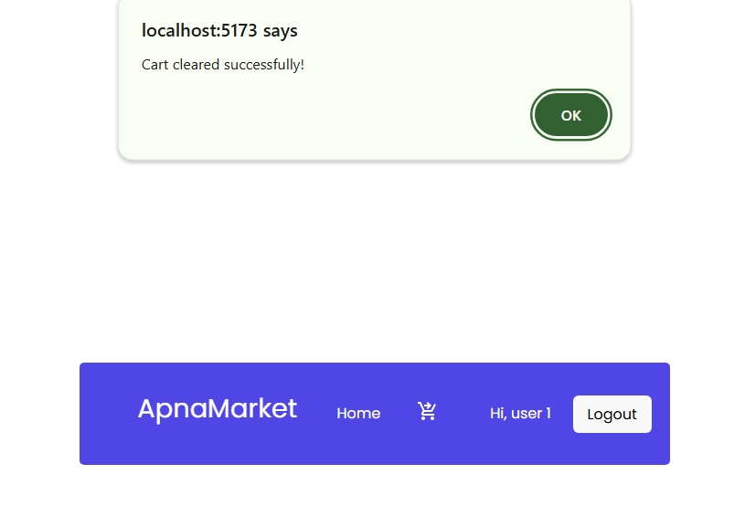 # order cleared after successful order
